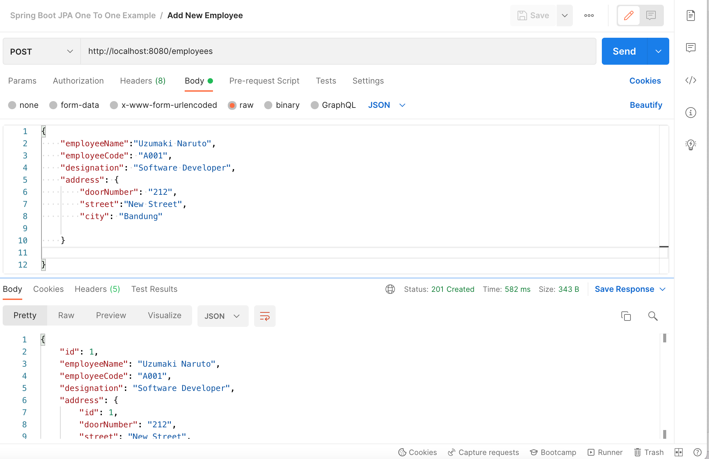
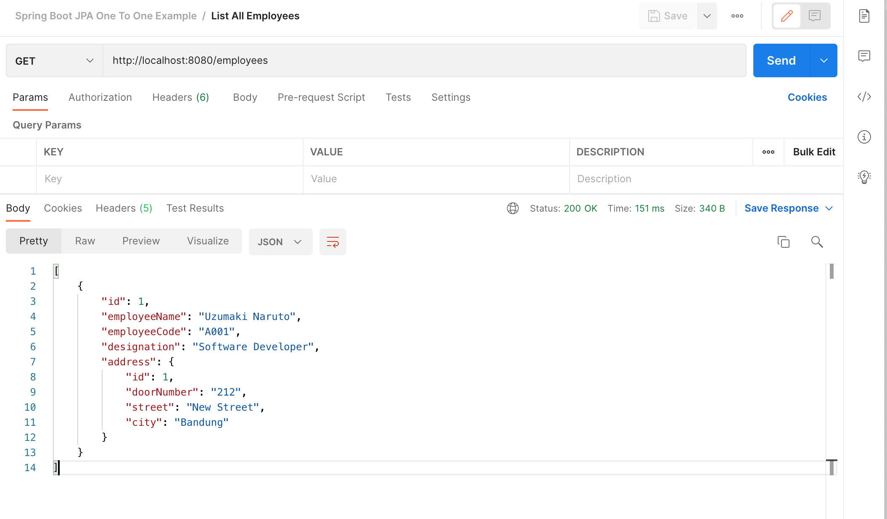
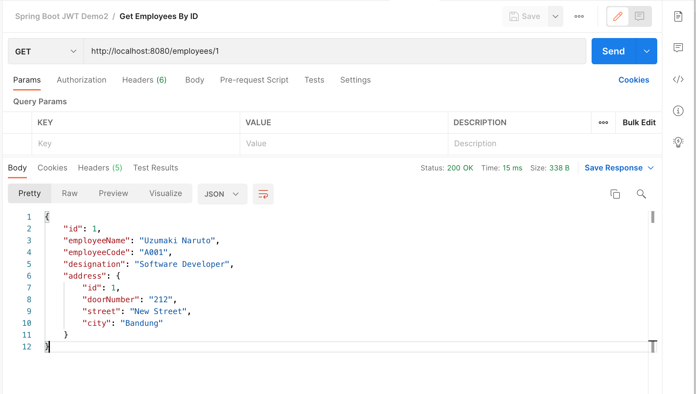
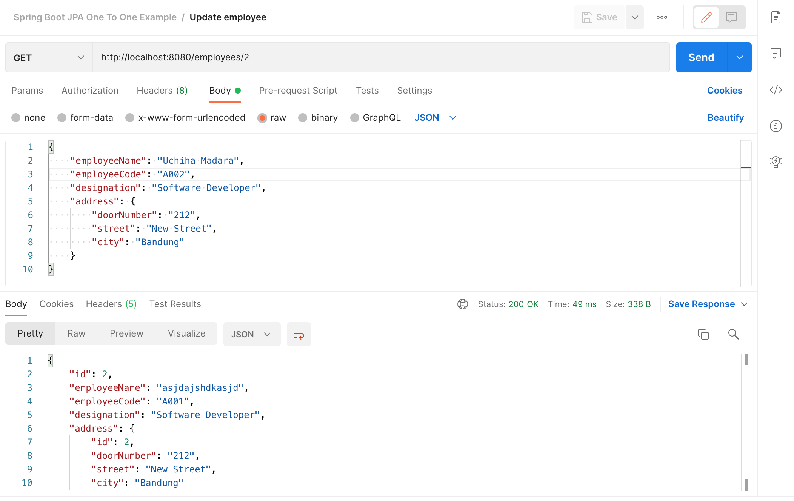

# spring-boot-jpa-one-to-one

### Things todo list:

1. Clone this repository: `git clone https://github.com/hendisantika/spring-boot-jpa-one-to-one.git`
2. Navigate to the folder: `cd spring-boot-jpa-one-to-one`
3. Replace PostgreSQL credentials with your own
4. Run the application: `mvn clean spring-boot:run`
5. Import POSTMAN Collection

### Image Screen shot

Add New Employee

List All Employee

Get Employee By ID

Update Employee By ID

